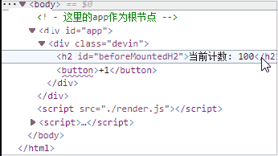

# 实现一个简易版的MVVN框架  
## 前言  
<!-- 待办事项的md语法：横框+ 空格+方括号（方括号中必须有空格或者x） + 空格+ 文本  
- [x] 已完成的待办1  
- [ ] 未完成的待办2 -->  
  
该mvvn框架是参考vue3实现的，包括如下内容：  
- [x] 渲染系统模块  
- [ ] 可响应式系统模块  
- [ ] 应用程序入口模块  
  
## 渲染系统模块  
该模块主要包含三个功能.  
- 功能一是 h()函数,用于返回虚拟节点vNode对象, 该对象包含三样东西tag, props, children.  
- 功能二是 mount函数，用于将vNode挂载到DOM上  
- 功能三是 patch函数，用于对两个vNode进行对比，决定如何处理新的VNode  
  
1. h() 生成虚拟节点  
  通过h()函数将传入的三个参数渲染成一个虚拟DOM节点返回，h()函数的第一个参数是代表着**标签**的tag, 第二个参数是代表着**属性**的props, 第三个参数是children，代表的是第一个参数tag标签的**内容**，当然这个内容也可以是子节点。    
    
     
2. mount() 将虚拟节点按照children中父子关系挂载，形成虚拟DOM树  
  mount()是挂载方法，其有两个参数，第一个参数vnode是需要被挂载的虚拟DOM节点，第二个参数是容纳第一个参数vnode(虚拟节点)的容器节点container．当所有的虚拟节点都按照各自children中的父子关系挂载好之后，就形成了虚拟DOM树。  
  首先处理tag标签，利用h函数暴露出来的tag生成一个标签节点元素，并将元素存储到虚拟节点vnode中。  
  然后处理props属性，如果是on开头，就监听事件，如果是普通的属性，就直接使用setAttribute来创建属性即可。  
  最后处理children属性，如果是children是字符串，就直接设置textContent即可，如果是数组节点，就遍历调用mount函数，使其作为子节点挂载。  
    
  
3. patch(oldNode, newNode) 函数： 一个更新旧节点的函数. 实现思路如下  
- 比较tag:  
如果旧节点含有的标签元素类型和新节点含有的标签元素类型不相同，直接删掉旧节点的标签，然后将新节点的标签添加进去即可。如果旧节点含有的标签元素和新节点含有的标签元素相同, 进行下一步  
  
- 处理props:  
先无脑将新节点的props属性全添加到旧节点，在添加的过程中遍历新节点的props，  
如果新节点的props的属性和旧节点的props属性含有一样的属性，但是二者的属性值不相同,那么我们就用setAttribute新建一个属性添加到老节点中，  
如果二者属性值相同,不做处理. 不需要考虑覆盖的的情况.只有相同的属性且其属性值也相同才保留,待全部添加完毕后,在旧节点中删除只存在于旧节点props但不存在于新节点props的属性, 剩下的都是patch处理之后的属性了  
  
- 处理children:  
处理新节点的children需要先判断其类型,然后再进行处理,  
如果新节点的children是字符串,那就好办,直接使用innerHTML将字符串赋值给旧节点即可.无需考虑旧节点children的情况  
如果新节点的children是数组,就比较麻烦,我们就要依据旧节点的children的类型来进行处理  
    &nbsp;&nbsp;&nbsp;&nbsp;如果旧节点的children的类型是string, 简简单单,直接清空旧节点的children,然后挂载新节点的children即可(因为已知新节点的children为数组)  
    &nbsp;&nbsp;&nbsp;&nbsp;如果旧节点的children也是数组,此时新旧节点的children都是数组. 我们需要先判断新旧节点children的数组长度, 使用长度小的那个数组长度A作为遍历的判断停止条件, 来控制patch(oldchildren, newchildren)的执行次数.  
    &nbsp;&nbsp;&nbsp;&nbsp;&nbsp;&nbsp;&nbsp;&nbsp;&nbsp;&nbsp;&nbsp;&nbsp;A次执行patch(oldchildren, newchildren)执行完之后,剩下的children数组元素就是仅存于一方的children中了,   
    &nbsp;&nbsp;&nbsp;&nbsp;&nbsp;&nbsp;&nbsp;&nbsp;&nbsp;&nbsp;&nbsp;&nbsp;如果存在于新节点的children中(即newChildren.length > oldChildren.length),就需要添加到旧节点中,添加方法就是直接遍历然后使用mount()挂载方法  
    &nbsp;&nbsp;&nbsp;&nbsp;&nbsp;&nbsp;&nbsp;&nbsp;&nbsp;&nbsp;&nbsp;&nbsp;如果存在于旧节点的children中(即newChildren.length < oldChildren.length),就需要删去,删除方法就是直接遍历然后使用removeChild()挂载方法  
  
patch()实现代码:  
```js  
const patch = (oldNode, newNode) => {  
  // 1. 处理tag.  
  // 如果标签都不相同,直接获取旧节点标签的父元素,然后使用父元素的removeChild方法删除旧节点的标签,然后添加新的标签  
  // 如果标签相同,不用处理,进行下一步即可  
  if(oldNode.tag !== newNode.tag) {   
    const oldNodeParent = oldNode.el.parentElement  
    oldNodeParent.removeChild(oldNode.el)  
    mount(newNode, oldNodeParent)  
  } else {  
    // 取到el对象.  
    const el = newNode.el = oldNode.el  
    // 2. 处理props  
    // 2.1 将新节点的props全都添加到旧节点的props中,如果二者存在属性相同,但是属性值不相同的情况,就直接在旧节点中新建一个  
    for(const key in newNode.props) {  
      const oldValue =  oldNode.props[key]  
      const newValue =  newNode.props[key]  
      if(oldValue !== newValue) { // 属性相同,但是属性值不相同  
        el.setAttribute(key, newValue) // 直接新建一个好了,不使用覆盖的方法  
      }  
    }  
    // 2.2 删除只存在于旧节点props中但是不存在于新节点props中的属性  
    const oldProps = oldNode.props || {};  
    const newProps = newNode.props || {};  
    for(const key in oldProps) {  
      if(!(key in newProps)) {  
        el.removeAttribute(key)  
      }  
    }  
  
    // 3.处理children  
    const oldChildren = oldNode.children || []  
    const newChildren = newNode.children || []  
    // 3.1 新节点的children类型是字符串,直接innerHTML方法即可  
    if(typeof newChildren === 'string') { // 新节点的children类型是字符串  
      oldChildren.innerHTML = newChildren  
    } else { // 3.2 新节点的children类型是数组  
      // 3.2.1 如果旧节点的children的类型是string, 简简单单,直接清空旧节点的children,然后挂载新节点的children即可  
      if(typeof oldChildren === 'string') {  
        el.innerHTML = ''  
        newChildren.forEach(item => {  
          mount(item, el)  
        })  
      } else {   
      // 3.2.2 旧节点的children也是数组,此时新旧节点的children都是数组.我们需要先判断新旧节点children的数组长度,   
      // 使用长度小的那个数组长度commonLength作为遍历的判断停止条件, 来控制patch(oldchildren, newchildren)的执行次数  
        // 1) commonLength次执行patch(oldchildren, newchildren)执行完之后,  
        // 剩下的children数组元素就是仅存于一方的children中了,   
        const commonLength = Math.min(oldChildren.length, newChildren.length)  
        // 举例测试:  
          // oldChildren: [v1, v2, v3, v8, v9]  
          // newChildren: [v1, v5, v6]  
        for(let i = 0; i < commonLength; i++) {  
          patch(oldChildren[i], newChildren[i])  
        }  
  
        // 2) 如果存在于新节点的children中(即newChildren.length > oldChildren.length),  
        // 就需要添加到旧节点中,添加方法就是直接遍历然后使用mount()挂载方法  
        if(newChildren.length > oldChildren.length) {  
          newChildren.slice(commonLength).forEach(child => {  
            mount(child, el)  
          })  
        }  
  
        // 3) 如果存在于旧节点的children中(即newChildren.length < oldChildren.length),  
        // 就需要删去,删除方法就是直接遍历然后使用removeChild()挂载方法  
        if(newChildren.length < oldChildren.length) {  
          oldChildren.slice(commonLength).forEach(item => {  
            el.removeChild(item.el)  
          })  
        }  
      }  
    }  
  }  
}  
```  
渲染系统模块完成效果预览:  
  
<!--  -->
  
## 响应式模块  
  